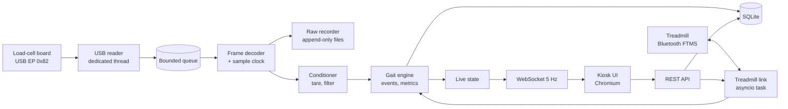
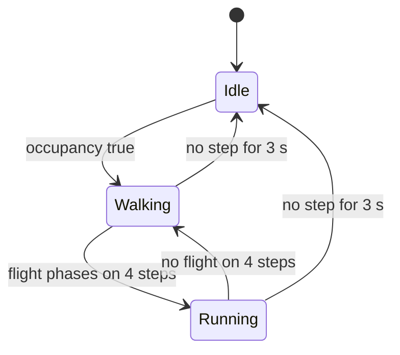
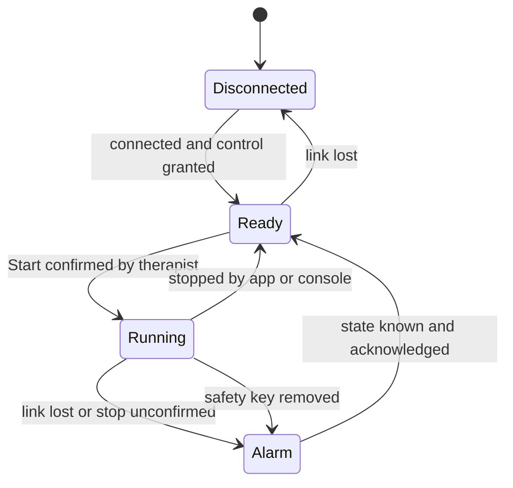
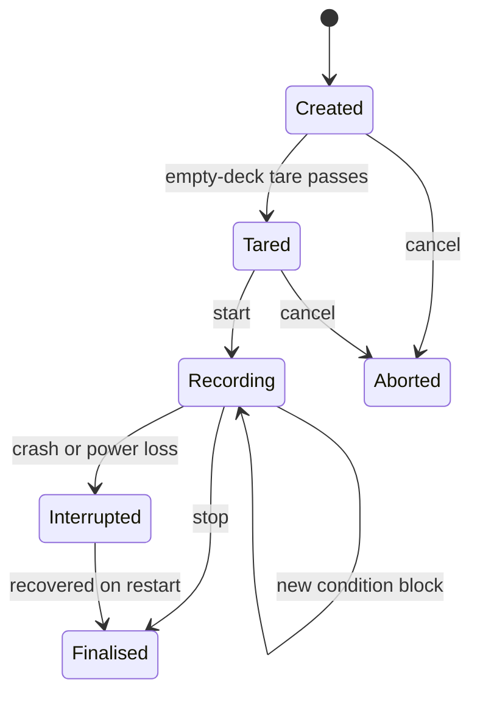
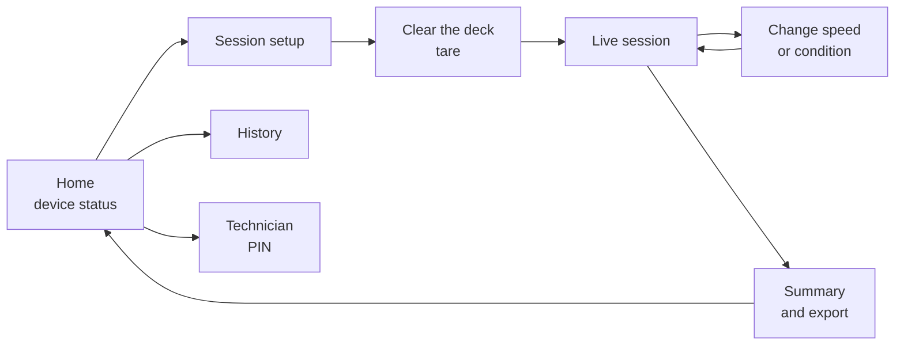

# TrendMill Gait Console — Phase 1 Design (N100 SBC)

Draft for review · 2026-09-19

## 1. Summary

Phase 1 runs on the N100 as one self-contained appliance: a Python backend reads the load-cell board over USB, computes cadence, step length and stride length from the top-left and top-right cells only, and serves a touch UI to a Chromium kiosk on the attached screen. It also drives the treadmill over Bluetooth — start, stop and speed — and reads back the speed the belt is running at. It is a clean rebuild, not a port of the Android app, but it keeps the parts of that app that proved right: the 64-byte decoder, the sample clock, and raw-first recording.

**Two-cell feasibility is backed by your own data.** Re-analysing the three recorded 80 Hz sessions (Babu, Eshaq, Nithin; 29 steady-speed holds), cadence from TL+TR alone agreed with an independent spectral estimate to a median of 1.1%, against 1.4% using all four cells. The front pair carried 28–45% of the deck load throughout. Both variants failed the same way at running speeds, which points at the detector, not at the choice of cells (section 3).

**Step and stride length need no force at all.** Both are belt speed multiplied by the time between foot contacts, so Phase 1 metrics depend on event timing and belt speed, not on calibration accuracy. That makes them robust to the coefficient problem found in September (32,400 vs 1,856 counts/kg).

**Treadmill control is designed around the treadmill's own emergency stop.** The app can start, stop and change speed over Bluetooth, but it is never the only way to stop the belt: Stop is one tap and is retried until confirmed, the app never moves the belt on its own after a reconnect or restart, and a lost link raises a full-screen alarm (section 8).

**Your MacBook can give real confidence, with two stated gaps.** The backend runs natively on macOS and can read the actual board over USB, and every recording can be replayed through the identical pipeline. What a Mac cannot prove is the Linux appliance layer: systemd, udev permissions, USB autosuspend and the kiosk. Those get a scripted checklist on the N100 itself (section 14).

| Decision | Proposed | Status |
| --- | --- | --- |
| Backend | Python 3.12, FastAPI, asyncio, libusb via pyusb | Proposed |
| Frontend | React + TypeScript (Vite), served by the backend | Proposed |
| Storage | SQLite for records; raw binary files for samples | Proposed |
| OS and display | Debian 13 or Ubuntu Server 24.04 LTS; Cage compositor; Chromium kiosk on the attached touch screen | Proposed; reference image **needs your choice** |
| Logging | Structured JSON to journald; watched live with `journalctl`, over SSH, or in an in-app log panel | Proposed |
| Metric inputs | TL + TR only; all four cells still recorded | Decided by you |
| Hardware | MSI Cubi N ADL S-213BIN: Intel N100, 16 GB RAM, one M.2 drive, Wi-Fi 5, Bluetooth 5 | Ordered |
| Load-cell data | USB, 64-byte packets from the ADS131M04 board, as in the Android app today | Decided by you |
| Treadmill control | Start, stop, speed and incline over Bluetooth FTMS; the treadmill's own emergency stop stays primary | Decided by you |
| Belt speed source | The speed the treadmill reports over Bluetooth; therapist entry only as a fallback | Follows from treadmill control |
| Deck orientation | "Top" = the end the patient faces | **Needs confirmation** |
| Phase 1 access control | Single local operator, no login | **Needs your decision** |

Out of scope for Phase 1, as you set: asymmetry and all graphs. Also deferred: PDF reports, patient history comparison, and body-weight-support metrics (section 2).

## 2. Scope and requirements

Phase 1 delivers three live metrics and everything needed to trust them: robust acquisition, condition blocks, raw recording and replay. The requirement IDs below are from `docs/app-requirements.md`; each is marked with how much of it Phase 1 carries.

| Requirement | Phase 1 treatment |
| --- | --- |
| FR-01 Device connection and capture | **Full.** Connect, stream, reconnect without blending segments, health counters. Gap detection is limited: the firmware sends no sequence number (section 5). |
| FR-02 Calibration and sensor health | **Partial.** Per-session empty-deck tare, stored calibration profile, technician known-weight calibration. Not a gate for Phase 1 metrics, which are timing-based. |
| FR-03 Patient and session setup | **Partial.** Opaque patient ID, therapist, starting speed and **maximum speed**, BWS %, incline, assistance, notes. `F_ref` and body-weight baseline deferred. |
| FR-04 Live dashboard | **Partial, no charts.** Connection, actual sample rate, drop indicator, belt speed, session and walking time, distance, the three metrics, a diagnostics panel. |
| FR-05 Data processing | **Full,** adapted to two cells (section 6). |
| FR-06 Adaptive event detection | **Full,** with per-step confidence and "unavailable" instead of a guess. |
| FR-07 Gait metrics | **Cadence, step length, stride length only.** |
| FR-08 Variable belt speed | **Full, and stronger than the requirement.** The requirement assumed tester-entered speed; Phase 1 uses the speed the treadmill reports, integrated over each step, with automatic `TRANSITION` flags and condition blocks. |
| New: treadmill control | **Full.** Start, stop, speed and incline over Bluetooth, with the safety rules in section 8. Not in the original requirements, which described a monitor-only app. |
| FR-09 Condition-aware analysis | **Full.** Median and IQR per condition block, never one blended average. |
| FR-10 End-of-session report | **Minimal.** Summary screen plus CSV and JSON export; PDF deferred. |
| FR-11 History and export | **Minimal.** Session list and re-export; cross-visit comparison deferred. |
| FR-12 Raw retention and replay | **Full.** It is also the backbone of the test strategy. |

**Explicitly out of scope:** asymmetry of any kind, all charts and graphs, force and load metrics (peaks, impulse, loading rate, CoP), `F_ref` and body-weight support analysis, PDF reports, multi-user roles and remote access.

One scope call to check: step length has two values per stride (right-to-left and left-to-right). Phase 1 **stores both** but **displays their mean**, because showing the pair side by side is an asymmetry display by another name.

### Non-functional targets

| Target | Value |
| --- | --- |
| Raw samples lost by software, 8-hour soak | 0 |
| Latency, foot contact to updated number on screen | < 300 ms |
| Metric refresh on screen | per accepted step, UI capped at 5 Hz |
| Cold boot to ready screen | < 60 s |
| Recovery after USB unplug and replug | < 3 s, new segment marked |
| Raw storage | about 63 MB per hour (transfers plus arrival times) |
| CPU on the N100 at 977 Hz | < 15% of one core |

The raw rate is small: 976.5625 samples/s × 4 channels × 4 bytes is 15.6 KB/s. Performance is not the risk on this hardware; correctness and unattended reliability are.

## 3. Why TL + TR only works for Phase 1

Two front cells are enough for step timing, because every step moves load both forward and sideways, and the front pair sees both. They are not enough for anything that needs the total load.

**What the pair measures.** On a rigid deck, a foot landing near the front raises the front pair's share of the load: `F = TL + TR` rises at each contact. The side of the new foot tips that share one way: `D = TR − TL` changes sign at every step. So the sign flip of `D` marks a step and names the foot, and the rise of `F` pins down when it landed.

**What the pair cannot measure.** Total load (the rear cells carry the rest), body weight, anything force-based, and a clean heel-strike instant: the earlier 80 Hz analysis timed heel strike from the fore-aft centre of pressure, which needs the rear cells. Phase 1 uses the lateral flip and the front-load rise instead.

### Evidence from your recorded sessions

The same filter and detector ran on the lateral signal from all four cells and from TL and TR alone. Each result is compared with a spectral cadence estimate that detects no steps at all, over the last 10 s of each steady-speed hold (29 holds, 3 participants, 80 Hz, previous firmware).

| Speed band | Holds | Median error, 4 cells | Median error, TL + TR | Holds over 5% error (4 cells / TL + TR) |
| --- | --- | --- | --- | --- |
| 1 km/h | 3 | 5.6% | 2.9% | 2 / 1 |
| 2–5 km/h | 12 | 0.7% | 1.0% | 1 / 1 |
| 6–8 km/h | 6 | 0.8% | 0.8% | 1 / 0 |
| 9–12 km/h | 8 | 2.6% | 4.3% | 3 / 4 |

The front pair carried 28–45% of the deck load in every hold, and its lateral signal was about 0.6× the size of the four-cell one. Events from the two methods landed within one 80 Hz sample (12 ms) of each other.

Read this as a feasibility result, not a validation. The reference is independent but is not ground truth; the data is 80 Hz from the old firmware; there are three people. At 9–12 km/h both methods degrade, because a lateral-flip detector is the wrong tool once there is a flight phase. Running needs contact-onset detection (section 6).

### Risks and guards

| Risk | Effect | Guard in Phase 1 |
| --- | --- | --- |
| Patient drifts to the rear of the deck | Front share falls, signal weakens, missed steps | Track the amplitude of `D` against the session's own baseline; below 40%, prompt "Step forward on the deck" and mark steps low-confidence |
| One front cell fails or clips | Every metric is lost | Pre-session health check: flatline, clipping, noise; block the session with a clear message |
| Handrail or therapist support | Less load on the deck, weaker signal | Confidence drops; metrics go "unavailable" rather than guessed |
| Running (flight phase) | Lateral flips blur between contacts | Separate running detector from `F` onset; running marked "unvalidated" until it passes acceptance |
| "Top" is actually the rear | Front-load logic inverts | Orientation is a configured setting, confirmed at install (open question) |

All four channels are still decoded and recorded. That costs nothing, lets Phase 2 add asymmetry without new data collection, and lets the acceptance test compare the two-cell metrics against a four-cell reference on the same recording.

## 4. System architecture

The appliance is two systemd services on one N100: `trendmill-core`, a single Python process that owns the board, the maths, the storage and the API; and `trendmill-kiosk`, a locked-down browser showing the UI from `localhost`. Nothing leaves the machine in Phase 1.



Raw samples branch off to the recorder *before* any processing, so a bug in the gait engine can never corrupt the recording, and every session can be re-processed later by a fixed or improved engine.

### Why one process

- **The load is tiny.** 244 USB reads/s and 977 samples/s is well within one Python thread; the N100 has four cores to spare.
- **Timing stays coherent.** Arrival stamps, the sample clock, belt-speed changes and step events share one monotonic clock (`time.monotonic_ns`), with no cross-process clock alignment.
- **Blocking I/O is isolated.** The USB read blocks, so it runs on its own OS thread and hands packets to the asyncio loop through a bounded queue. If the queue ever fills, that is counted and shown, never silently dropped.
- **Crash recovery is systemd's job.** `Restart=always` with a watchdog; the recorder writes append-only segments, so a crash loses at most the last second, and the restart opens a new, clearly marked segment.

### Components

| Component | Responsibility | Key technology |
| --- | --- | --- |
| USB reader | Claim interface 1, read 64-byte transfers from EP 0x82, stamp arrival | pyusb on libusb 1.0 |
| Treadmill link | Connect to the pinned treadmill, request control, send commands, receive speed and status | `bleak`: BlueZ on Linux, CoreBluetooth on macOS |
| Frame decoder and sample clock | Alignment, decode 4 × 4 int32, per-sample times, health counters | Pure Python, ported from the Android `FrameSync` |
| Raw recorder | Every packet plus its arrival time to disk, checksummed per segment | Binary files, SHA-256 |
| Conditioner | Tare, unit conversion, low-pass filter, decimation | NumPy |
| Gait engine | Occupancy, contact events, cadence, step and stride length, confidence | Pure Python and NumPy, deterministic |
| Session service | Sessions, condition blocks, per-step records, export | SQLite via SQLAlchemy Core |
| API | REST for control, WebSocket for live state, static UI files | FastAPI, Uvicorn |
| Kiosk | Full-screen browser, no escape to the desktop | Cage (Wayland) and Chromium |

The gait engine and decoder import nothing from FastAPI, USB or the database. They are plain functions over arrays, which is what makes them testable on any machine, including your MacBook.

## 5. USB ingest and packet decoding

The backend reads exactly what `graph.py` reads: 64-byte bulk transfers from endpoint 0x82 on interface 1, decoded as 16 little-endian int32 values in four samples of four channels. What it adds is alignment protection, per-sample timing and health counters.

### Device

| Item | Value | Source |
| --- | --- | --- |
| Vendor / product ID | 0x413D / 0x2107 | Firmware descriptors in `ads131.bin` |
| Interface 0 | HID boot keyboard, interrupt IN 0x81 — ignored as an input device (section 11) | Firmware descriptors |
| Interface 1 | Vendor-specific (class 0xFF): bulk IN 0x82, bulk OUT 0x02, 64-byte max packet | Firmware descriptors |
| ADC | ADS131M04, 976.5625 samples/s per channel (1.024 ms) | Firmware team |
| Packet rate | 244.140625 transfers/s | Derived |
| Channel order | ch0 = TL, ch1 = TR, ch2 = BR, ch3 = BL | Carried from the old firmware — **to confirm** |

### Packet layout

```text
offset  0: ch0 ch1 ch2 ch3   sample 1 (oldest)
offset 16: ch0 ch1 ch2 ch3   sample 2
offset 32: ch0 ch1 ch2 ch3   sample 3
offset 48: ch0 ch1 ch2 ch3   sample 4 (newest)
16 x int32 little-endian, no header, no timestamp, no checksum
```

### Read loop

1. Open by VID/PID, claim interface 1, detach a kernel driver only if one is bound to it.
2. Loop `read(0x82, 64, timeout=200 ms)`; stamp each transfer with `time.monotonic_ns()` the moment it returns.
3. A transfer of exactly 64 bytes is decoded. Anything else is counted as `short_transfers` and **discarded, not buffered**. libusb returns whole transfers, so there is no byte stream to re-slice, and discarding removes the permanent-misalignment failure the Android app had to guard against.
4. 25 consecutive timeouts (5 s) means the device is gone: close, mark the segment ended, retry with 1 s backoff. A new connection opens a **new segment**; segments are never stitched together.

### Sample clock

Four samples arrive together, so each gets a reconstructed time rather than the transfer's arrival time. This is the same algorithm as the Android `FrameSync`, which has unit tests for it: seed the period at 1.024 ms, follow the observed period with smoothing, pull gently toward each arrival (gain 0.1), and snap to real time after a gap over 100 ms. The one change: timestamps are **integer microseconds**, not milliseconds, so the 1.024 ms spacing is not rounded to 1 ms.

### Health counters

| Counter | Meaning | Warning when |
| --- | --- | --- |
| `observed_rate_hz` | Samples per second, last 1 s and session median | Off nominal by more than 2% |
| `rate_deficit` | Expected minus received samples, per 10 s window | Any sustained deficit |
| `short_transfers` | Transfers that were not 64 bytes | Any |
| `timeouts`, `reconnects` | Link interruptions | Any during a session |
| `queue_overflows` | Reader outran the pipeline | Any (this is a software fault) |
| `out_of_range` | A value outside the 24-bit ADC range, ±8,388,608 | Any — sample marked corrupt, not used |
| `flatline`, `clipping` per channel | A cell stuck or saturated | Blocks session start for TL or TR |

**Packet loss cannot be detected directly.** The format has no sequence number, so a dropped transfer leaves no trace except a small rate deficit. The earlier 80 Hz recordings lost 0.9–2.1% of packets in bursts, and that was only visible through firmware timestamps. A one-byte rolling counter in each packet would fix this; it is on the firmware wish list in section 15.

## 6. Gait algorithm

The engine turns TL and TR into a list of foot contacts, each with a time, a side and a confidence; cadence, step length and stride length are then simple arithmetic on accepted contacts and the belt-speed timeline. Every threshold adapts to the patient; none is a fixed kilogram value.

### 1. Conditioning

1. **Tare.** Before the patient steps on, a 3 s empty-deck capture gives each channel's zero as the median. Loads are `(raw − zero) / coefficient`, signed so that load is positive. Without a calibration profile the engine works in counts; timing metrics are unaffected because every threshold is relative.
2. **Low-pass.** A causal 2nd-order Butterworth at 12 Hz on TL and TR at 977 Hz, then decimation by 4 to 244 Hz (one value per USB packet). Its constant group delay (about 19 ms) is subtracted from every event time.
3. **Derived signals,** at 244 Hz:

```math
F(t) = TL(t) + TR(t) \qquad D(t) = TR(t) - TL(t) - \overline{D}_{3\,s}(t)
```

`F` is the front load; `D` is the lateral balance with its slow drift removed (a 3 s moving median), so standing slightly off-centre does not bias the side decision.

### 2. Is anyone walking?

Metrics run only while all three hold: the belt speed is above 0.1 m/s; the spread of `F` over 2 s is more than 5× the empty-deck noise; and the amplitude of `D` over 4 s is more than 5× its noise. Otherwise the engine reports "no one walking" rather than counting noise as steps, which the Android app had to learn the hard way.

### 3. Contact detection



**Walking.** `D` swings to the side of the newly loaded foot at every step. A contact is declared when `D` crosses `+h` (right) or `−h` (left), having last been on the opposite side, with hysteresis `h = 0.35 × A`, where `A` is half the 5th-to-95th percentile range of `D` over the last 4 s. The contact time is then refined to the onset of the rise in `F` within 80 ms before the crossing (where `F` passes 20% of that step's rise); if no clear onset exists, the zero crossing of `D` is used and the contact is marked medium confidence.

**Running.** Between contacts both feet are off the belt and `F` falls to near zero. When that happens for 40 ms or more on four consecutive steps, the engine switches mode: a contact is the upward crossing of `F` through 25% of its recent peak, and its side is the sign of `D` over the first 60 ms of contact. The 9–12 km/h results in section 3 are why this mode exists.

### 4. Validation and confidence

Each contact is checked before it can count:

| Check | Rule |
| --- | --- |
| Alternation | Must be the opposite side from the previous accepted contact |
| Timing | Step time within 0.25–2.0 s walking, 0.20–0.60 s running, and within ±40% of the rolling median |
| Refractory | At least 0.20 s, or 40% of the median step time, since the previous contact |
| Data integrity | No segment boundary, corrupt sample or rate deficit inside the interval |
| Signal strength | `A` at least 40% of the patient's walking baseline for this condition block |
| Speed | Belt speed known for the whole interval |

**High** confidence passes every check with `A` at 60% of baseline or more; **medium** passes with `A` between 40% and 60%, or with an unrefined contact time; **low** fails one soft check and is stored but never displayed or summarised; a hard failure makes the step **unavailable**. Three high- or medium-confidence alternating steps are needed before any number appears on screen.

### 5. Metrics

For accepted contacts at times `t_k`, alternating sides, with belt speed `v(t)`:

```math
\text{step length}_k = \int_{t_{k-1}}^{t_k} v(t)\,dt \qquad \text{stride length}_k = \int_{t_{k-2}}^{t_k} v(t)\,dt
```

```math
\text{cadence} = \frac{60}{\operatorname{median}(t_k - t_{k-1})}\ \text{steps/min, over the last 8 accepted steps}
```

`v(t)` is the speed the treadmill reports over Bluetooth, about once a second, linearly interpolated between reports. At a constant speed these reduce to speed × time. Integrating keeps them right when the speed changes mid-step. A step during which the speed changed by more than 0.05 m/s is flagged `TRANSITION`: stored, shown greyed, excluded from condition-block summaries.

| Shown on screen | Definition |
| --- | --- |
| Cadence | Steps/min, median of the last 8 accepted steps |
| Step length | m, median of the last 8 accepted steps, both sides pooled |
| Stride length | m, median of the last 4 accepted strides |
| Per condition block | Median, interquartile range and accepted-step count for each |

### 6. Versioning and parameters

Every parameter above lives in one versioned configuration (`gait-engine 1.0.0`), and the version is stored with every session. Re-processing an old recording with a newer engine creates a new derived result; it never overwrites the original. The starting values are educated defaults; the acceptance recordings in section 13 are what will tune them.

## 7. Calibration

Phase 1 metrics are timing-based, so calibration does not gate them; a fresh empty-deck tare at the start of each session does. The technician calibration is still built now, because it is small, the maths already exists with tests, and Phase 2 depends on it.

### Per-session tare (mandatory)

Before every session the operator confirms the deck is empty. The backend takes 3 s of data and stores each channel's median as zero, its noise (standard deviation) and its drift over the capture. The session cannot start if TL or TR is flat, clipped, or drifting by more than 1% of its typical walking range.

### Technician calibration (optional in Phase 1)

Ported from the Android app's `DeckCalibrationSolver`, including its test suite:

| Method | Procedure | Output |
| --- | --- | --- |
| One capture | Tare, then a known weight anywhere on the deck | One shared coefficient: known weight ÷ change in the sum of all four cells |
| Four positions | Tare, then the same weight over each corner in turn | A coefficient per cell, solved from four equations; falls back to shared when the positions are too alike |
| Verification | The weight at five positions | Pass if every reading is within ±2% of the known weight |

Calibration uses all four cells even though Phase 1 metrics use two: the deck-sum method is only correct over the whole deck.

### Profiles and firmware changes

Each profile stores its zeros, coefficients (counts/kg), method, verification result, operator, date, and the board's firmware version. The firmware version comes from the USB device descriptor's `bcdDevice` field (currently 0x0100). The September problem, where a 58 kg person read 3.33 kg, happened because a coefficient from the old firmware was applied to the new one. The backend therefore marks a profile **invalid** whenever the connected board reports a different firmware version than the one it was made with.

The current coefficient, about 1,856 counts/kg, comes from a single 58 kg capture and is provisional until a verification run passes.

## 8. Treadmill control over Bluetooth

The backend controls the treadmill over Bluetooth Low Energy using the standard Fitness Machine Service (FTMS): start, stop, speed and incline. It also reads back the speed the belt is running at, which replaces therapist-typed speed as the input to step and stride length. Because this software now moves a belt with a patient on it, one rule governs the design: **the treadmill's own emergency stop and safety key remain the primary safety system, and the app is never the only way to stop the belt.**

Load-cell data stays on USB, exactly as in the Android app today. The two links are independent: losing Bluetooth never interrupts measurement, and losing USB never affects control.

### Carried over from the Android app

The Android app's Bluetooth code learned several things on the real treadmill. They are ported with their unit tests:

| Fact | Consequence if forgotten |
| --- | --- |
| Request control (opcode `0x00`) before any command, and again after every reconnect | The treadmill answers every command with "Control not permitted" |
| Stop is `08 01`; the spec sheet's `08 02` only pauses | The belt keeps moving when the app says Stop |
| Speed is uint16 in 0.01 km/h; incline is sint16 in 0.1 %; little-endian | Wrong speeds, silently |
| In Treadmill Data, flag bit 0 is inverted: speed is present when it is clear; `FF FF` means "not available" | Every later field shifted by two bytes; 65,535 read as a real value |
| Step the speed from the last *requested* target, not the reported speed | The reported speed lags while the motor ramps, and repeated presses get stuck at one value |
| Fitness Machine Status reports stops at the console and removal of the safety key | The app shows "running" after the patient has pulled the safety key |

### Characteristics used

| UUID | Name | Use |
| --- | --- | --- |
| 0x1826 | Fitness Machine Service | Scan filter when pairing |
| 0x2ACC | Fitness Machine Feature | Read once: which commands this machine supports |
| 0x2AD4 / 0x2AD5 | Supported speed / inclination range | Read once: hard limits for every command |
| 0x2ACD | Treadmill Data | Notified about once a second: reported speed, incline, distance |
| 0x2ADA | Fitness Machine Status | Notified on events: console stop, safety key, speed changed |
| 0x2AD9 | Fitness Machine Control Point | Commands written here; each answered by an indication with a result code |

### Commands

| Command | FTMS frame | When it is allowed |
| --- | --- | --- |
| Start belt | `07` | Live screen only, after the therapist confirms "Patient is harnessed and ready"; the session must be tared and recording. Speed is set to the session's starting speed first |
| Stop belt | `08 01` | Always. One tap, no confirmation, from every screen while the belt is moving |
| Set speed | `02 <uint16>` | Between the treadmill's minimum and the session maximum, in 0.1 km/h steps |
| Set incline | `03 <sint16>` | Within the treadmill's supported range, only if the machine reports the feature |

The "few other things" to control are not yet specified; each will be added to this table with its own guard (section 15).

### Safety rules

1. **Stop always wins.** Stop bypasses the command queue and is sent immediately. With no "accepted" reply within 500 ms it is resent, up to three times. If the stop is still unconfirmed, or the reported speed has not started falling within 3 s, a full-screen red alarm says: "Stop not confirmed — use the treadmill's emergency stop."
2. **No movement the therapist did not ask for.** After a reconnect, crash, restart or update, the app requests control but sends no start and no speed. It never resumes the belt on its own.
3. **Limits are enforced by the backend, not only the UI.** The therapist sets a maximum speed per session (default 3.0 km/h), clamped to the treadmill's supported range. Each press changes the target by 0.1 km/h, and the target cannot rise faster than 1.0 km/h in any 5 s.
4. **A lost link is an alarm, not a status icon.** If Bluetooth drops while the belt is moving: a full-screen alarm with sound, "Treadmill connection lost — the belt may still be running. Use the treadmill's controls." Reconnection is attempted every 2 s, and the alarm stays until the therapist acknowledges it and the treadmill's state is known again.
5. **Console and safety-key events are obeyed.** "Stopped by safety key" raises a full-screen alert and locks Start until the therapist acknowledges it. Any speed change the app did not request is shown as "Speed changed at the console", and the app follows the reported speed.
6. **One controller, one treadmill.** The treadmill's Bluetooth address is pinned during installation, and the backend connects only to that address. In a clinic with several treadmills, it can never control the wrong one.
7. **Every command is audited.** Each command, reply and status event is stored with its timestamp and the session, and logged under component `ble`.



**Unknown and important:** what the treadmill does by itself when the Bluetooth link drops. FTMS does not require it to stop. If it keeps running, the app's alarm is the only software protection. A treadmill-side rule — stop the belt if the controller has been silent for 3 s — would be far safer, and is on the question list (section 15).

### Speed as a measurement

- **Source.** The speed in each Treadmill Data notification, about 1 Hz, interpolated for the step-length integral. Each step stores its speed source: `treadmill`, or `target` if the machine stops reporting speed, or `entered` in monitor-only mode.
- **Ramps.** After a speed command the belt takes several seconds to settle. Steps during that time are marked `TRANSITION` automatically. A new condition block starts once the reported speed has been within 0.05 km/h of the target for 3 s — the therapist no longer records speed changes by hand.
- **Accuracy.** Whether the treadmill reports a measured belt speed or simply echoes its target is not known. The acceptance test (section 13) checks it against a tachometer at 1, 3, 6 and 12 km/h; a consistent error becomes a per-treadmill speed correction stored with the calibration.

### Monitor-only fallback

If Bluetooth is unavailable or no treadmill is paired, measurement still works: the controls are hidden, the therapist enters the speed as in the original requirements, and lengths are labelled "from entered speed".

### Implementation

A `TreadmillLink` interface with two implementations: `FtmsLink`, built on `bleak`, and `SimulatedTreadmill`, an in-process model that answers commands, ramps its speed realistically and can be told to drop the link or pull the safety key. The simulator is what the tests, the UI tests and a hardware-free demo mode use — the same split as the USB reader and its replay device.

### Status, as built

Built and tested against the simulated machine (`backend/trendmill/treadmill/`, 27 controller tests and 21 protocol tests): connect and request control, start and stop, speed and incline stepping within the machine's reported range, belt state tracked from the machine's own reports, a session that starts the belt at 1.0 km/h and stops it when the session ends, and every speed change recorded as a session condition.

Two deviations from the sections above, both deliberate:

- **Step and stride length integrate the speed the operator selected, not the speed the treadmill reports.** Section 7 specifies the reported speed. In practice that reading lags the target by seconds while the motor ramps and is coarsely quantised, so integrating it smears every length across a change rather than sharpening it; the selected speed is exact and constant between contacts. The reported speed is still shown beside the target, so a machine that does not reach what it was asked for stays visible — and it becomes the right input if the acceptance test (section 13) finds the belt does not track its target. Revisit once that test has run against a tachometer.
- **The belt always starts at 1 km/h, and a stopped belt has no speed.** Start — whether pressed or implied by starting a session — sends 1 km/h, never the speed before the last stop: the belt is stopped exactly when somebody is stepping on or off it. There is correspondingly no 0 km/h anywhere; a condition recorded while the belt was stopped carries no speed, and its lengths are unavailable rather than computed. This also settles a machine behaviour found in browser testing: the treadmill drops its target on stop and resumes at zero, so a bare start left a stationary belt under a console still reading 4 km/h.

Not yet built: the lost-link full-screen alarm (safety rule 4 above), reconnection every 2 s, and `POST /api/treadmill/pair` — a fixed address is pinned with `--treadmill-address` instead. Until the alarm exists, a dropped link shows as a status change and the belt is stopped from the treadmill's own controls.

## 9. Backend design

The backend exposes a small REST API for commands, one WebSocket for live state, and stores records in SQLite and samples in append-only binary files. It listens on `127.0.0.1` only: in Phase 1 the only client is the kiosk on the same machine.

### Session lifecycle



If the machine restarts mid-session, the session comes back as `Interrupted`: its raw segments are intact, and its steps are rebuilt by replaying them through the same engine version. A finalised session is immutable.

### REST API

| Method and path | Purpose |
| --- | --- |
| `GET /api/status` | Device, stream health counters, versions, active session |
| `POST /api/sessions` | Create: patient reference, therapist, first condition (speed, BWS %, incline, assistance), notes |
| `POST /api/sessions/{id}/tare` | Run the 3 s empty-deck tare; returns zeros, noise and pass or fail |
| `POST /api/sessions/{id}/start` | Begin recording and metrics |
| `POST /api/sessions/{id}/conditions` | New condition block when speed, BWS, incline or assistance changes |
| `POST /api/sessions/{id}/stop` | Finalise: write manifest, checksums, block summaries |
| `GET /api/sessions`, `GET /api/sessions/{id}` | History and session detail |
| `GET /api/sessions/{id}/export?format=csv\|json` | Per-step and per-block export |
| `GET/POST /api/calibration/...` | Profiles, capture, verification (technician screens) |
| `GET /api/treadmill` | Link state, control granted, belt state, reported and target speed, limits |
| `POST /api/treadmill/start` | Start the belt; requires the ready confirmation and an active session |
| `POST /api/treadmill/stop` | Stop the belt; never refused |
| `POST /api/treadmill/speed`, `/incline` | New target, checked against the session and treadmill limits |
| `POST /api/treadmill/pair` | Technician: scan for FTMS treadmills and pin one |

### Live WebSocket

`/ws/live` pushes one JSON message every 200 ms. The UI never receives raw samples:

```json
{
  "stream": {"state": "streaming", "rate_hz": 976.4, "deficit": 0, "warnings": []},
  "session": {"state": "recording", "elapsed_s": 312.4, "walking_s": 288.0,
              "distance_m": 240.1, "condition": {"id": 3, "speed_kph": 3.0}},
  "treadmill": {"link": "connected", "control": "granted", "belt": "running",
                "reported_kph": 3.0, "target_kph": 3.0, "max_kph": 4.0, "alarm": null},
  "gait": {"mode": "walking", "cadence_spm": 104.2, "step_length_m": 0.48,
           "stride_length_m": 0.96, "confidence": "high", "prompt": null}
}
```

A metric the engine cannot support is sent as `null` with a reason, and the UI shows "Unavailable" and the reason, never a stale number.

### Storage

| Store | Contents | Format |
| --- | --- | --- |
| `trendmill.db` (SQLite, WAL mode) | Sessions, condition blocks, segments, steps, tares, calibration profiles, treadmill commands and status events, speed reports, audit log | Relational, migrations via Alembic |
| `sessions/<uuid>/raw/segment-NNNN.tmraw` | Every USB transfer with its arrival time | 16-byte header, then 72-byte records: 8-byte arrival time in ns + the 64-byte transfer |
| `sessions/<uuid>/manifest.json` | Immutable snapshot at finalise: engine version and config, calibration ID, tare, segment SHA-256 checksums | JSON |

Raw files store the **untouched transfer bytes**, not decoded values. Replay then exercises the real decoder, and a decoder bug found later can be fixed and re-run against every past session. Files are flushed and `fsync`ed every second, so a power cut loses at most one second. At 244 transfers/s the raw store grows by about 63 MB per hour; a 256 GB disk holds roughly 3,000 hours.

### Privacy

Phase 1 stores an opaque patient reference, never a name or diagnosis, which keeps it clear of most health-data handling. The disk is encrypted with LUKS, unlocked by the N100's firmware TPM at boot. Export goes to a USB stick from the UI; there is no network API.

## 10. Frontend design

The UI is a single-page React + TypeScript app built for one therapist at a touch screen mid-session: three large numbers, clear status, and every control reachable with one tap. It is served by the backend from local files, with no internet access and no CDN.

### Operator flow



### Screens

| Screen | Contents |
| --- | --- |
| Home | Board connected and streaming, calibration status, **New session**, History, Technician |
| Session setup | Patient reference (opaque ID), therapist, belt speed, BWS %, incline, assistance, notes; large numeric keypad |
| Clear the deck | Instruction, 3 s progress, pass or a specific failure ("Top-right cell not responding") |
| Live session | Cadence, step length, stride length; confidence badge; status bar; belt controls (Start, Stop belt, speed ±); prompts; End session |
| Summary | Per condition block: median, interquartile range, accepted steps, transitions excluded; Export to USB |
| History | Past sessions by date and patient reference; open summary, re-export |
| Diagnostics | Every counter from section 5, engine version, tare values; behind a tap on the status bar |
| Technician | Calibration and verification, behind a PIN |

### Live session screen

The three metrics fill most of the screen, each at least 96 px high so they read from 2 m. Under each: its unit, its confidence as a word and an icon (not colour alone), and the accepted-step count. When a metric is unavailable, the number is replaced by "Unavailable" and a plain reason: "No one walking", "Step forward on the deck", "Belt speed not set", "Signal too weak".

**The belt controls are the most important part of the screen.** A red **Stop belt** button is fixed in the same place on every screen while the belt moves, and works with one tap. Speed is a pair of large −0.1 / +0.1 km/h buttons showing both the target and the speed the treadmill reports, so a ramp in progress is visible. Start appears only when a session is recording, and asks for confirmation that the patient is harnessed. Alarms (link lost, stop unconfirmed, safety key) take over the whole screen and cannot be dismissed until acknowledged.

### Touch screen

The UI is designed for the touch monitor attached to the N100, operated by a therapist standing beside a moving treadmill.

- **Input.** USB touch panels work through libinput under Cage with no extra driver. If the panel is mounted rotated, the kiosk start-up sets the output rotation with `wlr-randr`, and touch follows the output.
- **No system on-screen keyboard.** All text entry uses the app's own keypads: numeric for speed, BWS and incline, alphanumeric for the patient reference. A system keyboard can cover the metrics or fail to appear; an in-app one cannot.
- **Browser behaviour locked down.** Pinch-zoom, double-tap zoom, long-press menus, text selection and swipe navigation are disabled, and the pointer is hidden.
- **Screen stays on.** No blanking during a session; the Home screen may dim after 10 minutes idle.
- **Safe controls.** Primary controls (Stop belt, speed ±) are at least 64 px; nothing is under 48 px. **Stop belt is always a single tap.** Only End session, which finalises the recording, needs a 1 s press-and-hold, so a brushed screen cannot end a session — two different buttons, two different rules.

### Implementation choices

| Choice | Reason |
| --- | --- |
| React 18, TypeScript, Vite | Widely known; strict typing on the WebSocket message shapes shared with the backend |
| Zustand for state | One store fed by the WebSocket; no global event plumbing |
| No chart library | Graphs are out of scope; nothing to load |
| Types generated from the backend's OpenAPI schema | A field renamed on one side fails the build, not the clinic |
| Layout designed for 1920 × 1080, scaling down to 1280 × 800 | Assumed panel sizes; confirm the actual monitor |
| Updates at 5 Hz, numbers animate only when they change | Readable, and no flicker from a value that is merely re-sent |

If the WebSocket drops, the screen shows "Reconnecting" within 1 s and never keeps displaying the last numbers as if they were live.

## 11. Deployment on the N100

The N100 is set up as an appliance: power on, and within a minute the kiosk shows the Home screen with the board connected. Software ships as one versioned Debian package, installed side by side with the previous version so a bad update can be rolled back by the technician in one step.

### Hardware: as delivered

**The unit that arrived is a GMKtec NucBox G3 Plus (Intel N150), not the MSI Cubi N ADL S-213BIN this section was written around.** The table below is kept as the original specification; [deployment.md](deployment.md) describes the real machine. The differences that matter: the N150 is a later Twin Lake part (so Debian 13's 6.12 kernel rather than Ubuntu 24.04's 6.8), there is no DisplayPort or USB-C video so the touch monitor goes on HDMI and all four USB-A ports stay free for the board, and Bluetooth is 5.2. Nothing in the software changes.

### Hardware: MSI Cubi N ADL S-213BIN (as originally specified)

| Item | Specification | What it means for this design |
| --- | --- | --- |
| Processor | Intel N100, 4 cores / 4 threads, up to 3.4 GHz | Ample: the whole workload is under 15% of one core |
| Memory | 16 GB in the single SO-DIMM slot | The backend needs under 1 GB; the rest is headroom for the browser |
| Storage | One M.2 slot | The only drive, so it holds the OS and all sessions; at least 256 GB recommended. Backups leave by USB export |
| Bluetooth | Bluetooth 5, on the Wi-Fi card | Used for treadmill control. Wi-Fi shares the 2.4 GHz radio, so Wi-Fi is switched off unless needed |
| Networking | 2 × Gigabit Ethernet, 802.11ac Wi-Fi | Not used in Phase 1; one Ethernet port can serve as a service connection |
| Display | HDMI 2.1, DisplayPort 1.4, USB-C with DisplayPort Alt Mode | Touch monitor on HDMI or DisplayPort plus a USB cable for touch, or on USB-C alone |
| USB | Load-cell board | Plugged in directly, not through a hub. If the monitor takes the USB-C port, the board uses a USB-A port with a USB-A-to-C cable |

The unit is compact and passively cooled, so it will be tested in its final mounting position near the treadmill motor: the N100 slows itself when hot, and the 8-hour soak (section 13) runs there.

### Platform

| Layer | Choice | Why |
| --- | --- | --- |
| OS | Debian 13 (trixie) or Ubuntu Server 24.04 LTS, amd64, minimal install | Both are supported; one is chosen as the reference image. Their kernels (6.12 and 6.8) both support the N100's Alder Lake-N graphics and USB |
| Display | Cage (single-app Wayland compositor) running Chromium in kiosk mode | No desktop to escape to; restarts cleanly |
| Runtime | Python 3.12 installed and locked by `uv` under `/opt/trendmill/<version>/` | Independent of the distribution's own Python (3.13 on Debian 13, 3.12 on Ubuntu 24.04), so both distributions run identical code |
| Package | `trendmill_<version>_amd64.deb`: backend, built UI, systemd units, udev rules | One file to install, verify and roll back; built and tested in CI for both distributions |

Docker is used for testing (section 14) but not on the appliance. It adds a USB passthrough layer and an extra failure mode to a machine that runs one application.

### System configuration

- **USB permissions and power.** A udev rule for 413d:2107 gives the `trendmill` group access and turns USB autosuspend **off** for that device. Autosuspend is a classic cause of silently dropped transfers on Linux, and one the Mac cannot reproduce.
- **The board's HID interface.** Interface 0 of the board declares itself a boot keyboard. Left alone, Linux registers it as a keyboard that could type into the kiosk. A udev rule sets `LIBINPUT_IGNORE_DEVICE=1` on it, so it can never inject input.
- **Touch panel.** Detected through libinput; a udev rule pins it to the correct display output, with a calibration matrix only if the panel needs one.
- **Bluetooth.** BlueZ from the distribution. The Wi-Fi/Bluetooth card needs Intel firmware: included on Ubuntu, and in Debian's `firmware-iwlwifi` package from `non-free-firmware`. The `trendmill` user gets Bluetooth access through a D-Bus policy, not root. Wi-Fi is disabled with `rfkill` unless the clinic needs it.
- **Services.** `trendmill-core` runs as an unprivileged `trendmill` user with `Restart=always` and a 10 s systemd watchdog. `trendmill-kiosk` auto-logs in a `kiosk` user and starts Cage and Chromium pointed at `http://127.0.0.1:8080`.
- **Firmware settings.** In the MSI BIOS: power on after AC loss, no sleep or suspend, and the hardware watchdog on if offered.
- **Time.** Measurement uses the monotonic clock only. The wall clock labels sessions; the machine is offline, so the real-time clock battery matters.
- **Logs.** Persistent journald, capped at 500 MB; details in section 12.
- **Hardening.** Incoming firewall closed, SSH off by default (enabled by a technician for service, key-only), full-disk encryption as described in section 9.

### Updates and rollback

1. The technician inserts a USB stick with a signed package and taps **Update** on the Technician screen.
2. The backend verifies the signature, backs up the database, installs to `/opt/trendmill/<new version>/`, runs migrations, and switches the `current` symlink.
3. On the next boot, if `trendmill-core` fails its health check three times, the symlink returns to the previous version and the database backup is restored.

Updates are refused while a session is recording.

### Provisioning

A new unit is built from a clean Ubuntu install by one idempotent script, `provision.sh`: packages, users, udev rule, services, firewall, disk encryption enrolment. Running it on a second N100 must produce an identical appliance; that is how the first clinic unit and the spare stay interchangeable.

### Status, as built

`deploy/` holds the working deployment, and [deployment.md](deployment.md) is the runbook: `build-release.sh` (builds the UI, runs the tests, writes a tarball), `provision.sh` (packages, users, udev and D-Bus rules, the release under `/opt/trendmill/releases/<version>` with `current` symlinked to it, both services, the Cage/Chromium kiosk), and `test-provision.sh`, which runs the whole install on a clean Debian 13 or Ubuntu 24.04 container and then checks the console serves the API, the UI and treadmill control. Re-running `provision.sh` upgrades in place and is verified to leave sessions, calibration and the settings file untouched.

Three bugs came out of that container test, none of which the Mac could have shown:

- `provision.sh` sourced `/etc/os-release`, which defines `VERSION` and silently overwrote the release version being installed.
- `uv` put its managed interpreter under `/root`, so the virtualenv recorded a base path the unprivileged service user cannot read. The service died at startup with `No module named 'encodings'`, which names nothing relevant. The interpreter now goes to `/opt/trendmill/python`.
- `StartLimitIntervalSec` was in `[Service]`, where systemd ignores it, leaving the default limit of five restarts in ten seconds — after which a clinic would be left at a dead screen with no further attempts.

Not built, from the sections above: the `.deb` package, signed updates from the Technician screen with automatic rollback on three failed health checks, LUKS/TPM enrolment, and the firewall and SSH hardening. Updates are a re-run of `provision.sh`, and rollback is repointing the `current` symlink — both documented in the runbook.

## 12. Logging and live diagnostics

Every component writes structured JSON log lines to the systemd journal, and you can watch them live in three places: `journalctl` on the N100, the same command over SSH from a laptop, or a live log panel on the Technician screen. Each session also keeps its own log, which travels with its export.

### What is logged

| Level | When | Examples |
| --- | --- | --- |
| ERROR | Something failed | `usb.read_failed` (device gone), `storage.write_failed`, an unhandled exception with traceback |
| WARNING | A health threshold was crossed | `usb.short_transfer`, `stream.rate_deficit`, `pipeline.queue_overflow`, `tare.failed`, `calibration.firmware_mismatch` |
| INFO | Lifecycle, and a health line every 10 s | Start-up with versions; board connected with VID, PID, `bcdDevice` and serial; segment opened or closed; session state changes; condition changes; tare result |
| DEBUG | Per-step detail, off by default | Each contact: time, side, confidence and the rule that set it; walking-to-running switches |
| TRACE | Bring-up only | Hex dump of the first 20 transfers after each connection |

**Never logged:** individual samples (977 per second would drown the journal; they belong in the raw files) and any patient reference. Logs carry the session UUID only.

### Log format

```json
{"ts": "2026-09-19T10:24:13.512Z", "level": "warning", "component": "usb",
 "event": "usb.short_transfer", "session": "3f2a9c1e", "segment": 2,
 "count_10s": 37, "last_length": 12, "msg": "37 short transfers in the last 10 s"}
```

- **`component`** is one of `usb`, `decoder`, `clock`, `gait`, `ble`, `session`, `storage`, `api`, `ui`, `kiosk`. Every treadmill command and reply is logged under `ble` at INFO, so control is always traceable in a live tail.
- **`event`** is a stable identifier. Tests, filters and alerts key off it, never off the wording of `msg`.
- **Repeats are aggregated.** A warning that repeats is counted and emitted once per 10 s, so a fault at 244 transfers/s produces one line every 10 s, not 244 lines a second.

### The health line

Every 10 s at INFO, so a live tail always shows whether the stream is healthy without turning on DEBUG:

```text
health rate_hz=976.49 deficit=0 short=0 timeouts=0 queue_max=3 cpu=4.1% rss=142MB disk_free=211GB
```

### Watching logs live

On the N100, or over SSH from a laptop (`ssh tech@<n100-address>` first):

```bash
journalctl -u trendmill-core -f
```

```bash
journalctl -u trendmill-core -f -p warning
```

```bash
trendmill logs --follow --component gait --level debug
```

```bash
journalctl -u trendmill-kiosk -f
```

`trendmill logs` is a small command shipped in the package: it follows the journal and prints the JSON fields as readable, colour-coded lines, filtered by component and level.

**In the app:** Technician → Logs shows a live stream from an in-memory buffer of the last 5,000 records, with filters by level and component, a pause button, and Save to USB. It sits behind the technician PIN, because logs contain device and session detail.

**Changing verbosity without a restart:** the Logs panel (or `POST /api/logging` with a component and level) changes a level immediately. It reverts to the default on the next restart, so a forgotten DEBUG setting cannot fill the disk.

### Where logs are kept

| Location | Contents | Retention |
| --- | --- | --- |
| systemd journal, `/var/log/journal` | Everything from `trendmill-core` and `trendmill-kiosk` | Capped at 500 MB, oldest first out |
| `sessions/<uuid>/logs/events.jsonl` | Every record tagged with that session | With the session; immutable after finalise; included in exports |
| `sessions/<uuid>/logs/diagnostics.jsonl` | A health snapshot every second, as FR-04 requires | With the session |
| Frontend errors | Uncaught UI errors and WebSocket drops, sent to `POST /api/client-log` and logged as component `ui` | Journal |

Crashes leave a traceback in the journal, and systemd records the exit code and the restart. Core dumps are disabled, because they could contain session data.

### Tests for logging

- Every WARNING and ERROR path emits its documented `event` identifier.
- A patient reference passed through the whole pipeline never appears in any log record, journal or session log.
- 1,000 identical warnings inside 10 s produce exactly one aggregated line.
- A DEBUG level set at runtime is back to INFO after a restart.

## 13. Testing strategy

The metrics are only trustworthy if they are checked against known answers, so the test suite is built around three sources of truth: hand-built byte sequences for the decoder, a synthetic gait generator with exact ground truth for the engine, and real recordings for regression and acceptance. Everything except the soak test runs on any machine, with no board attached.

### Test layers

| Layer | Tools | What it proves | Runs |
| --- | --- | --- | --- |
| Unit | pytest, Hypothesis | Each function is right, including edge cases | Every commit, < 30 s |
| Synthetic gait | pytest + generator | The engine recovers known cadence and lengths within bounds | Every commit, < 2 min |
| Golden recordings | pytest snapshots | Real data still gives the same answers; any change is reviewed | Every commit |
| Integration | pytest, httpx, a replay device, the simulated treadmill | USB-to-database-to-WebSocket pipeline, treadmill control, session lifecycle, crash recovery | Every commit |
| UI | Vitest, Testing Library, Playwright | Screens, unavailable states, the full therapist flow against a replaying backend | Every commit |
| Soak and faults | Scripted, on the N100 with the board | 8-hour stability, unplug, power cut, disk full | Before each release |
| Acceptance | Video reference, participants | Accuracy of the three metrics | Before clinical use |

### Key unit and property tests

| Area | Cases |
| --- | --- |
| Decoder | Interleave order; little-endian; signed values (−184, ±2³¹); short transfer discarded and counted; a 24-bit out-of-range value marked corrupt |
| Sample clock | First packet spread by the nominal period; tracks 976.5625 Hz; never runs backwards under bursty arrivals; snaps after a 5 s stall; relearns after a real rate change (ported from the Android suite) |
| Filter | Unity gain at DC; attenuation at 50 Hz; measured group delay equals the constant subtracted from event times |
| Occupancy | Empty deck with vibration: no steps; standing still: no steps; belt stopped: no metrics |
| Detector | Alternation enforced; refractory respected; hysteresis resists noise chatter; walking-to-running switch and back |
| Metrics | Constant speed: step length = v × step time; speed ramp: integral, not endpoint speed; stride = sum of its two steps; `TRANSITION` flagged at a speed change |
| Calibration | The eight Android solver tests, ported, including the 58 kg capture giving 1,856 counts/kg |
| FTMS protocol | The Android parser and command tests, ported: inverted flag bit, `FF FF` not-available values, stop is `08 01`, speed encoding, reply codes, stepping from the last target |
| Treadmill safety | Stop sent immediately and retried; unconfirmed stop raises the alarm; no motion command after a reconnect or restart; speed limit and ramp limit enforced by the backend; start refused without confirmation; safety-key event locks Start; link loss while running raises the alarm; only the pinned address is used |
| Storage | Raw segment round-trip is bit-exact; checksum detects a flipped byte; a truncated last record is recovered |
| Properties (Hypothesis) | Any arrival jitter keeps timestamps monotonic; decode(encode(x)) = x; cadence × step length / 60 = belt speed at steady state |

### Synthetic gait generator

A test-only module produces four-cell traces from a simple rigid-deck model: each foot lands at a set position, travels back with the belt, and splits its load between the four corners by its position. It encodes them into real 64-byte transfers with realistic arrival jitter and bursts. Because the true contact times are known exactly, every scenario asserts error bounds:

| Scenario | Expected |
| --- | --- |
| Walking 1–6 km/h, cadence 60–130 steps/min | Cadence within 1%, lengths within 3%, no missed steps |
| Running 8–12 km/h with flight phases | Mode switches to running; cadence within 2% |
| Patient drifts to the rear third of the deck | "Step forward" prompt; confidence falls; no false steps |
| Handrail takes 50% of the load | Confidence medium or unavailable; never a wrong number shown as high confidence |
| Belt speed ramps mid-session | Lengths follow the integral; ramp steps flagged `TRANSITION` |
| Treadmill reports speed at 1 Hz with jitter | Step lengths within 3% of those from the true speed |
| 2% of transfers dropped in bursts | Rate deficit reported; affected steps excluded |
| One front cell flatlines | Session blocked at tare, or metrics unavailable mid-session |
| Empty deck, belt running, motor vibration | Zero steps |

### Real recordings

The three 80 Hz sessions become the first golden files: the engine runs at their 80 Hz rate (the nominal rate is a parameter, not a constant) and its outputs are stored as reviewed snapshots. New 977 Hz recordings replace them as the primary set as soon as they are captured. Every golden run also computes a **four-cell reference** result from the same data, so the two-cell engine is continuously compared with the best estimate the hardware can give.

### Acceptance criteria (proposed)

Measured against step counts and contact times from 60 fps video, with the belt speed checked by a tachometer:

| Metric | Walking 1–6 km/h | Running 7–12 km/h |
| --- | --- | --- |
| Steps detected | ≥ 98% of video steps | ≥ 95% |
| False steps | ≤ 1% | ≤ 2% |
| Cadence error | ≤ 2% or 2 steps/min | ≤ 3% |
| Step and stride length error | ≤ 5% | ≤ 7% |

Suggested sample: at least 5 participants, including one with an asymmetric gait, at BWS 0%, 30% and 50%. Until running passes, it is labelled "unvalidated" on screen.

Treadmill safety is also checked by hand before release, on the real treadmill with no one on it: pull the safety key, press stop at the console, switch off Bluetooth mid-run, and kill the backend mid-run. Each must produce the documented alarm and no unrequested movement.

### Continuous integration

Every commit runs lint (`ruff`), strict typing on the core (`mypy`), all non-hardware tests in Linux amd64 containers for both Debian 13 and Ubuntu 24.04 (the N100's architecture) and on macOS, builds the `.deb`, and runs the Playwright flow against a replaying backend. The target is 90% line coverage on the decoder, clock and gait engine.

## 14. Testing on your MacBook

Yes: your MacBook can run the entire application against the real board, and can run the exact Linux build the N100 will use. Together those cover everything except the appliance layer, which is closed by a scripted checklist on the N100 itself.

### Three ways to run it on the Mac

| Mode | How | What it proves | What it cannot prove |
| --- | --- | --- | --- |
| **1. Native, with the board** | `brew install libusb`; plug the board into the Mac; run the backend; open `localhost:8080` in a browser | The real board, real USB transfers, real decoder, real engine and real UI, end to end. The strongest single test | Linux USB behaviour, N100 timing |
| **2. Linux amd64 container** | Docker Desktop, `--platform linux/amd64`, the same Debian or Ubuntu image as the appliance | The exact dependencies, x86-64 wheels and Linux file paths the N100 uses; the full test suite and a replayed session | Anything USB: Docker Desktop cannot pass USB through from macOS |
| **3. Ubuntu virtual machine** | UTM running the chosen distribution (arm64 for speed), with USB passthrough to the board | The appliance layer: `provision.sh`, systemd units, udev rule, kiosk start-up, crash restart | x86-64 specifics (covered by mode 2) and N100 hardware |

Mode 1 works because the board's data interface is vendor-specific: macOS binds no driver to it, so the backend can claim it from user space without root. macOS keeps interface 0 (HID); the backend never touches it.

### Keeping the Mac honest

- **One code path.** The backend has no macOS branch. The only platform-specific line is the Linux kernel-driver detach, which libusb skips where it does not apply.
- **Bluetooth works on the Mac too.** `bleak` uses the Mac's own Bluetooth, so the Mac can connect to the real treadmill and run the control flow. One difference: macOS hides Bluetooth addresses and gives each device a per-computer ID instead, so the pinned treadmill is stored per platform.
- **Record on the Mac, replay on the N100.** A session recorded on the Mac is replayed on the N100 (and vice versa); the step lists must match. Results are compared with a tolerance, not bit-for-bit, because NumPy on Apple Silicon and on x86-64 can differ in the last digits of a float.
- **Touch is emulated, then confirmed.** Playwright runs the UI flow with touch emulation, and Chrome's device mode shows the layout at the panel's resolution. How the real panel feels, and its calibration, can only be checked on the N100.
- **Logs are the same.** On the Mac the backend logs the same JSON to the terminal instead of the journal, so `trendmill logs` filters work identically.
- **Timing is tested, not assumed.** Arrival jitter on macOS differs from Linux. The sample clock's tests already cover bursty and jittered arrivals, and the N100 checklist measures the real jitter.

### What only the N100 can confirm

A script, `tools/n100_check.sh`, runs once on each new unit and prints pass or fail for each item:

1. The board enumerates as 413d:2107 and the `trendmill` user can open it without root.
2. The Bluetooth adapter is up, and the `trendmill` user connects to the pinned treadmill and is granted control.
3. With no one on the belt: Stop is confirmed by the treadmill within 500 ms; switching off Bluetooth mid-run raises the alarm within 2 s.
4. Bluetooth stays connected for the whole 8-hour soak at the installed position.
5. USB autosuspend is off for the board.
6. Five minutes of streaming: observed rate within 0.1% of 976.5625 Hz, zero short transfers, zero queue overflows.
7. Arrival jitter 99th percentile under 2 ms.
8. A replayed golden session produces the expected steps.
9. Unplug and replug: new segment within 3 s.
10. `kill -9` of the backend: restarted by systemd within 10 s, session recovered as `Interrupted`.
11. Pulling the power mid-session: on reboot, the session is recovered with at most 1 s of data lost.
12. Kiosk comes up on the touch screen after a cold boot in under 60 s.
13. The encrypted disk unlocks from the TPM without a prompt.
14. Touch: taps in all four corners register within 5 px of the target; pinch and long-press do nothing.
15. The board's HID interface is ignored by libinput and cannot type into the kiosk.
16. `trendmill logs --follow` shows the health line every 10 s, and the Logs panel shows the same stream.

Then the 8-hour soak from section 13. If mode 1 passes on the Mac, mode 2 passes in CI, and this checklist passes on the N100, the remaining risk is in the gait algorithm's accuracy, which only the acceptance test with real participants can settle.

## 15. Plan, risks and open questions

The first milestone is recording real 977 Hz sessions, because every later step — tuning, golden tests, acceptance — depends on having them. Estimates assume one to two developers and are rough until the open questions are answered.

### Repository layout

```text
trendmill-console/
  backend/trendmill/
    device/        usb_reader.py, replay_device.py
    treadmill/     ftms.py, link.py, simulator.py, safety.py
    protocol/      decoder.py, sample_clock.py, health.py
    signal/        filters.py, conditioner.py
    gait/          occupancy.py, detector.py, metrics.py, engine.py, config.py
    calibration/   solver.py, tare.py
    storage/       raw_segments.py, db.py, migrations/
    sessions/      service.py, export.py
    api/           app.py, routes/, ws.py
    logging/       setup.py, aggregator.py, ring_buffer.py
  backend/tests/   unit/, synthetic/, golden/, integration/
  frontend/        src/, tests/, e2e/
  deploy/          provision.sh, systemd/, udev/, debian/
  tools/           record.py, replay.py, n100_check.sh, trendmill_logs.py
```

### Milestones

| Milestone | Weeks | Done when |
| --- | --- | --- |
| M1 Acquisition | 1–2 | Board streams to the backend on your Mac; raw recorder and replay work; first 977 Hz reference sessions recorded |
| M2 Gait engine | 3–4 | Engine, synthetic generator and four-cell reference pass their tests; golden snapshots in CI |
| M3 Application | 5–6 | API, sessions, storage, WebSocket and all Phase 1 screens; Playwright flow green |
| M3b Treadmill control | 6–7 | FTMS link, simulator, safety rules and their tests; control verified on the real treadmill with no one on it |
| M4 Appliance | 8 | `provision.sh`, package, kiosk; N100 checklist and 8-hour soak pass |
| M5 Acceptance | 9–10 | Participant testing against video; parameters tuned; release 1.0 |

### Remaining risks

| Risk | Effect | Mitigation |
| --- | --- | --- |
| Treadmill keeps running when Bluetooth drops | The app cannot stop the belt | Full-screen alarm; treadmill emergency stop remains primary; ask for a treadmill-side timeout |
| Reported speed is the target, not the real belt speed | Step and stride length wrong during ramps or under load | Tachometer check in acceptance; per-treadmill correction |
| Bluetooth range or interference at the installed position | Dropped links, alarms mid-session | Wi-Fi off; soak test in place; a USB Bluetooth adapter with an external antenna as a fallback |
| Running accuracy | Cadence errors at 9–12 km/h, as in section 3 | Dedicated running detector; labelled unvalidated until acceptance passes |
| Dropped USB transfers are invisible | Steps silently lost | Rate-deficit counter now; sequence counter from firmware later |
| Left and right cells swapped in wiring | Side labels wrong | Phase 1 metrics pool both sides, so the displayed numbers are unaffected; checked at install |
| Clinical use of unvalidated numbers | Misleading therapy decisions | "Estimated" labels, confidence on every value, non-diagnostic wording, acceptance before clinical use |

### Open questions

- [ ] **The other things to control.** Which, beyond start, stop and speed: incline, body-weight support, others? Each needs a command and a safety rule.
- [ ] **Treadmill behaviour on link loss.** Does the belt keep running when Bluetooth drops? Can the manufacturer add a stop after 3 s without a controller?
- [ ] **Reported speed.** Is the Treadmill Data speed a measured belt speed or the target echoed back?
- [ ] **Maximum speed.** Is 3.0 km/h the right default session limit, and what is the absolute ceiling for this clinic?
- [ ] **Storage.** Size and type (NVMe or SATA) of the M.2 drive ordered.
- [ ] **Monitor connection.** HDMI or DisplayPort plus USB for touch, or USB-C alone? This decides which port the load-cell board uses.
- [ ] **Deck orientation.** Are TL and TR at the end the patient faces? The whole two-cell design assumes they are.
- [ ] **Channel wiring.** Is ch0–ch3 = TL, TR, BR, BL confirmed for the ADS131M04 board?
- [ ] **Firmware requests.** Can the firmware add a one-byte sequence counter, confirm values are 24-bit sign-extended, and bump `bcdDevice` on every release?
- [ ] **Operating system.** Debian 13 or Ubuntu Server 24.04 as the reference image? Both work; picking one halves the testing.
- [ ] **Touch monitor.** Model, size, resolution, and whether it is mounted in portrait or landscape.
- [ ] **Access.** Is a single local operator with no login acceptable for Phase 1?
- [ ] **Step length display.** Is one pooled step length on screen right, with both sides only in the export?
- [ ] **Validated range.** Walking 1–6 km/h validated for release, running shown as unvalidated — acceptable?
